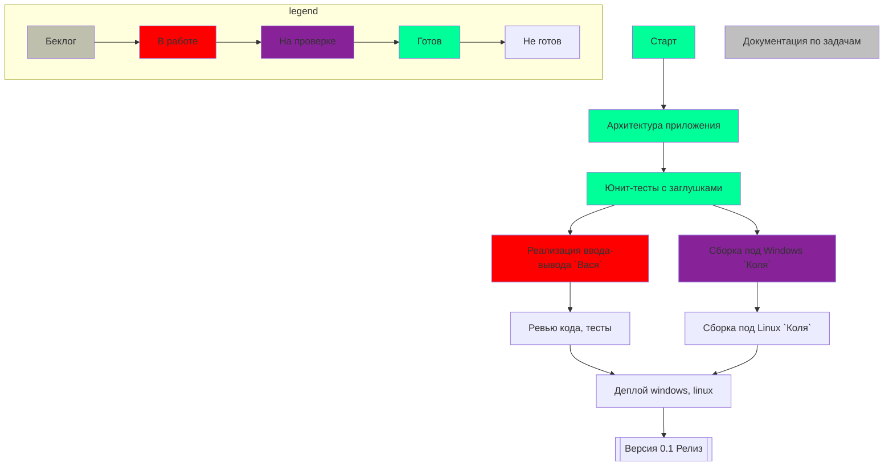

### Продукт X Релиз 0.1

Порядок выпуска релизов



| Задача                  | Описание                                                                  | Ответственный | Результат                                |
| ----------------------- | ------------------------------------------------------------------------- | ------------- | ---------------------------------------- |
| Архитектура приложения  | Выделение классов для работы приложения, вместо реальных модулей заглушки | Петя          | Код классов + заглушки                   |
| Юнит-тесты              | Юнит-тесты для ядра, линковки модулей.                                    | Петя          | Юнит тесты для заглушек                  |
| Сборка под Windows      | Проверить, все ли библиотеки переносимы                                   | Коля          | Бинарник                                 |
| Реализация ввода-вывода | CLI, web                                                                  | Вася          | Бинарник                                 |
| Ревью кода, тесты       | Не забыть оценить покрытие!                                               | Петя          | Процент покрытия, прохождение линтера    |
| Сборка под Linux        | Как обычно                                                                | Петя          | Бинарник                                 |
| Деплой                  | Как обычно                                                                | Петя          | Инсталлер для винды, деб-пакет для Linux |
| Версия 0.1              | Минимальный функционал                                                    | Петя          | Выложили в хранилище артефактов          |

### По беклогу

- Документацию надо вести сразу в markdown!

### Пример вставки блока

- Запуск приложения deviceQuery по пути `c:\Program Files\NVIDIA GPU Computing Toolkit\CUDA\v11.2\extras\demo_suite\deviceQuery.exe`, вывод:
  
  ```
  CUDA Device Query (Runtime API) version (CUDART static linking)
  
  Detected 1 CUDA Capable device(s)
  
  Device 0: "GeForce GTX 1660 Ti"
    CUDA Driver Version / Runtime Version          11.2 / 11.2
    CUDA Capability Major/Minor version number:    7.5
    Total amount of global memory:                 6144 MBytes (6442450944 bytes)
  …
  ```

### Пример отрисовки диаграмм в vega-light

Простое решение собирать данные в JSON-структуру и рендерить в статическую веб-страничку с помощью [vega-light](https://vega.github.io/vega-lite/):

```vega-lite
{
  "description": "A simple bar chart with embedded data.",
  "data": {
    "values": [
      {"a": "A", "b": 28}, {"a": "B", "b": 55}, {"a": "C", "b": 43},
      {"a": "D", "b": 91}, {"a": "E", "b": 81}, {"a": "F", "b": 53},
      {"a": "G", "b": 19}, {"a": "H", "b": 87}, {"a": "I", "b": 52}
    ]
  },
  "mark": "bar",
  "encoding": {
    "x": {"field": "a", "type": "nominal", "axis": {"labelAngle": 0}},
    "y": {"field": "b", "type": "quantitative"}
  }
}
```
